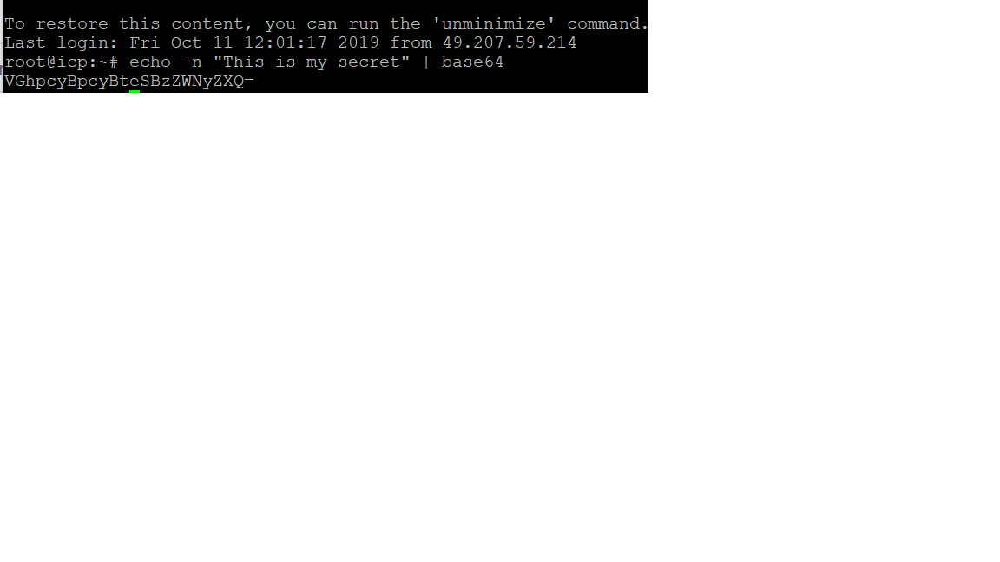

<b>
 Installing IBM TransformationAdvisor on IBM Cloud Private
 </b></a>

---
# Installation of Transformation Advisor on ICP Cloud
---

# 1. prerequisites

Install IBM Private cloud on Ubuntu VM. If not done  already, please follow the instructions below:
   
        https://github.com/srinivma1/IBM-ICP-Install/blob/master/1-ICPInstallationLab.md
        
        
# 2. install TA on ICP

1. Generate a secret. 

2. Create secrets.yaml file

            {
              "apiVersion": "v1",
              "kind": "Secret",
              "metadata": {
                "name": "transadv-secret",
                "namespace": "transadv-dev",
                "resourceVersion": "5450"
              },
              "data": {
                "db_username": "VGhpcyBpcyBteSBzZWNyZXQ=",
                "secret": "VGhpcyBpcyBteSBzZWNyZXQ="
              },
              "type": "Opaque"
            }
            
  3. In the ICP Catalog, select ibm_trans_adv_dev catalog and provide following parameters.
  
  
  
  
        
        

